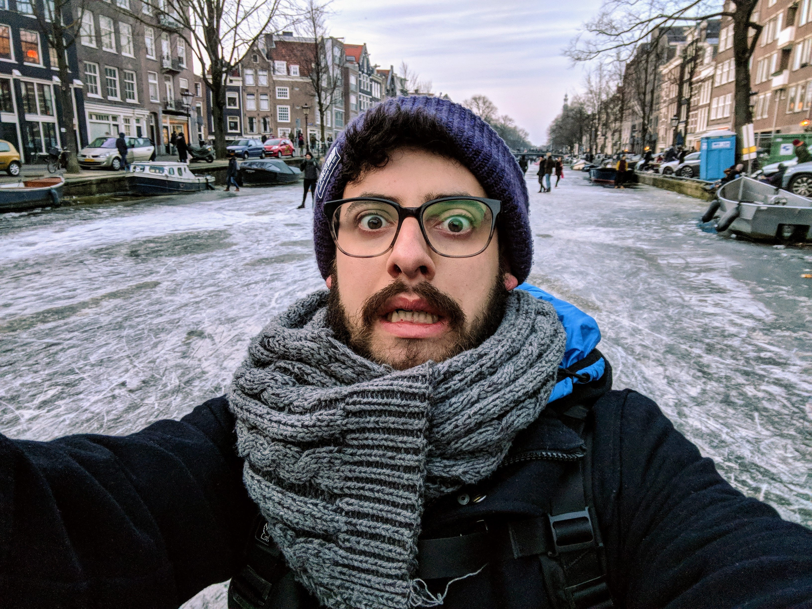

Hi there, my name is Weslley Araujo. I am a self-taught Software engineer from Brazil, currently living and working in Amsterdam 🇳🇱

My career starts when I was around 17 years old.

Out of nowhere, I got a job as a ✨ web designer ✨ in a small agency back in [São Bernardo do campo - São Paulo](https://en.wikipedia.org/wiki/São_Bernardo_do_Campo) where I fell in love with programming.

I have nearly 10 years of experience in a variety of products such as Content Management, Live Sports streaming, E-Commerce, etc. Lately, I am working as a Senior Front End Developer at [Booking.com](http://booking.com/) helping them to shape the future of Experiences in the travel industry.

As a Software engineer, I have worked with a vast umbrella of topics, but what makes me the happiest and where I find the real joy of my profession are User Interfaces ❤️

_Funny fact about me: My name is misspelled with a double **L**! My father says it was a typo on my documents, my mom says it was intentional for some reason_ 🤔

Follow me [@\_weslleyaraujo](https://mobile.twitter.com/_weslleyaraujo)
