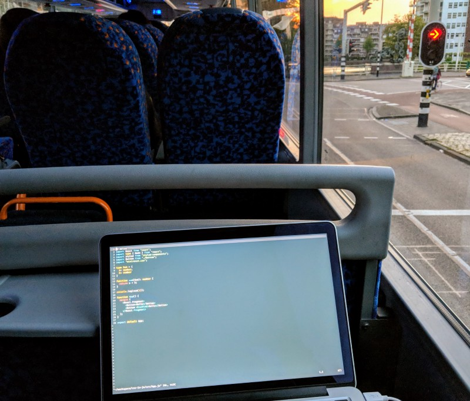

Living abroad makes you grow up, I realized that I am much more mature now after the 2.5 years since I moved away from my home country. It's amazing.

Since I was around 15 years old this wish of living somewhere else other than Brazil always popped into my head. But I never thought about the trade-offs… and I have to admit, sometimes its super tough

I miss my family, weather, food, language… or simply showing up in a friends place out of nowhere for a beer during the week. You have to build up your whole social network from “scratch”, making new friends and making connections step by step. It’s not easy, not for me at least.

I have always been an introvert person. I just hate when everyone’s eyes are over me, and I never enjoyed attention or exposure in any way... _HATED_ every time I had to make a presentation in front of my classmates in high school😅 (I still have some stage phobia on me due to that)

That sucks, and especially when living abroad.

But I have a bunch of new friends now (_I made it yay!),_ people that I will be friends with for life. But still, those childhood friends from home… damn I miss those motherfuckers.

Sometimes I wish there was a metro connection that would take me there for the weekend, just swipe my card and 💥, 10 min later I am there. That would be so cool (please do it Musk 🚄)

Alright it seems that I am just talking about the bad parts, but here it goes some highlights in my life during these 2.5 years:

· Grew up so much professionally, my #1 goal 👨‍💻  
· Traveled to quite a few countries 🇬🇧🇵🇹🇪🇸🇧🇪🇺🇸🇨🇿🇭🇺🇫🇷🇩🇪🇨🇭🇮🇸  
· Everywhere is safe, I am no longer afraid of going out at any time ❤️  
· Can English now _(kinda of)_ 🗣  
· Been to Brazil at least 3 times during this period, which is cool 🇧🇷💯  
· Bought an apartment 🏡

When I think back on all of this I get quite proud of myself, makes me happy

If you thinking about living abroad just do it, **_you will regret if you don’t._** You should experience this at least once in life

Feel free to DM me [@\_weslleyaraujo](http://twitter.com/_weslleyaraujo "Twitter profile for @_weslleyaraujo") on twitter about the topic (or literally about anything). I talk javascript stuff in there as well 💻

PS: I wrote this on a bus from Groningen to Amsterdam. I can just use my Macbook pro on a bus without being scared of anything… I could NEVER do that in Brazil 😔

