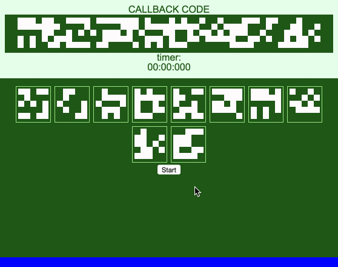
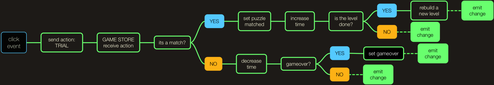
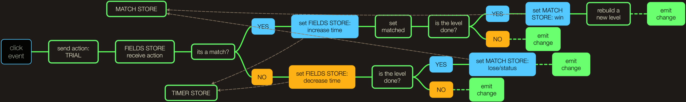
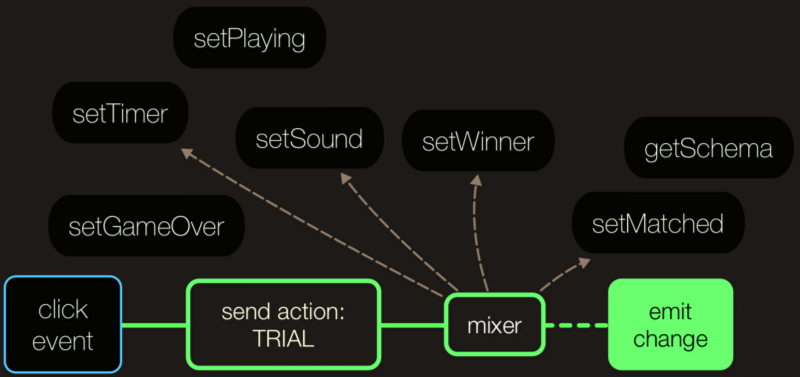

Recently I have launched my first [project](http://weslleyaraujo.github.io/react-flux-puzzle) using an architecture completely different from what I’m used to. I got into this whole new thing called Flux, or in other words I followed a _unidirectional_ data flow..

I do have a background on writing code with the good old MVC architecture. Hell, I was addicted to a library called [Backbone.js](http://backbonejs.org) (you probably have heard of it, right?). Then there was this **BOOM** and suddenly the only thing I could see in my timeline was _FLUX, REACT, UNIDIRECTIONAL…_

Everything was different, there were the dispatcher, stores, actions… And of course the view layer almost every time built with React.

So, I started looking for any information about this new whole thing, and the very first article/tutorial that I took was the [The Flux Quick Start Guide](http://www.jackcallister.com/2015/02/26/the-flux-quick-start-guide.html) by [@jarsbe](https://twitter.com/jarsbe) , which gave me a really good introduction to it.

After playing with it a little bit, I finally decided to get my hands dirty by using all this shiny stuff on a real project. I wanted to really understand the purpose of Flux and its advantages.

#### The Idea

I always loved to build games for the browser, I believe that by doing so you can truly learn awesome stuff such as how to deal with data, event handlers and so on…

Let me go back in time a little bit… Back to last September I was playing a great game called [Alien Isolation](http://alienisolation.com), and then suddenly this happened:

> A puzzle from one of Alien Isolation’s missions

The first time I saw it, I thought _“I wanna build it using all these new front end technologies!”_

#### Hands on

I started coding with the following stack:

- **Gulp** (as my task runner)
- **Browserify + Babelify** (to create my code bundle, and also to allow me write es6 code)
- **Flux** (the library provided by facebook, which gives you a simple dispatcher)
- **React** (the one responsible to take care of my view layer)

And after some long hours of coding I got my first _"playable"_ prototype:

very first version of the project

Well, the game was very cool but my code… let me try to quickly explain a bit of it.

I had a huge store with almost 200 lines of code, that was dealing with the whole game, and well... that's a lot!

There were too many logic in the same place, and this is something that I always try to avoid when I'm coding.

Take a look in what was happening whenever the user clicks on a puzzle item:

As I said before, that's a lot…

And then I started thinking _"Why not split this into different stores?"_, seems like a good idea right?

So, I created 3 different stores:

- **TimerStore** (responsible for the countdown/timer)
- **MatchStore** (responsible for any data related to the game, such as status, win/loses, etc)
- **FieldStore** (responsible for each _"puzzle"_ in the game)

All right, now I kind of have different "modules" to deal with its own data at time.. but well, lets figure out what would happen whenever the user clicks in a _"puzzle"_ item:

And after doing this… **WTF!**

I was doing exactly what I should not do with Flux, messing up with my data and transforming it in a non-unidirectional way. Besides that, just looking at this image you can imagine the number of conditions and complexity that I added to my code…

#### The "Solution"

In the meantime I started studying new stuff… suddenly part of my day was looking at these awesome flux implementations such as [RefluxJS](https://github.com/reflux/refluxjs), [Flummox](https://github.com/acdlite/flummox), [Redux](https://github.com/rackt/redux), etc.. and they were really good!

I was about to choose one of those libs when there were this awesome guy (which works with me) that said *"Hey, why don't you use Rx.js to handle this Flux implementation and Stores?"* — [@omauriciosoares](http://twitter.com/omauriciosoares).

Well I have to say that this opened my mind to a whole new perspective, it turns out that [**Rx.js**](http://reactivex.io/) is such a great guy to deal with that.

My stores and actions became something called **“**[**Subjects**](http://reactivex.io/documentation/subject.html)**”**, which simply are streams that you can observe and subscribe to. I also have changed all the data to use [**Immutable.js**](https://facebook.github.io/immutable-js/) objects. That’s a win/win specially when you are working with React (which is exactly the case for my game).

#### Ok but, how to deal with all that data transforming you have shown in a action?

The first thing I did was to keep with the idea of a single and immutable store, and since I'm working with immutable data I could create a bunch of [Pure Functions](https://en.wikipedia.org/wiki/Pure_function) (that are functions that will receive data and return a new one without knowing and affecting its parents), [**_compose_**](http://underscorejs.org/#compose) them and execute at each given action:

The _"mixer"_ will be a composition of those functions that are connected together, and by doing that I could really split all my logic into single parts! You can take a better look into the code [here](https://github.com/weslleyaraujo/react-flux-puzzle/blob/master/src/assets/js/helpers/store-utils.js) and [here](https://github.com/weslleyaraujo/react-flux-puzzle/blob/master/src/assets/js/store/state-store.js).

And I end up with the stack:

- **Rx.js** (responsible to deal with my "flux" architecture)
- **Immutable.js** (responsible to deal with my data)
- **Browserify + Babelify** (to create my code bundle, and also to allow me write es6 code)
- **React** (my view layer)

and some simple scripts to deal with tasks running right into npm.

#### Final thoughts

To change your mindset from MVC its not easy at all, but I’m really happy with the final result. It’s really good to see how UI development is changing so fast to a better approach.

And none of that would be possible if those awesome guys (that I'm lucky to work with) had helped with so many things and gave me awesome ideas to solve those problems.

cc [@omauriciosoares](http://twitter.com/omauriciosoares), [@hugobessaa](https://twitter.com/hugobessaa), [@rafaelrinaldi](https://twitter.com/rafaelrinaldi), [@igorapa](https://twitter.com/igorapa), [@raphaelfabeni](https://twitter.com/raphaelfabeni)

I was almost forgetting, the code is hosted at [**Github**](http://github.com/weslleyaraujo/react-flux-puzzle) and you can play the final version of the game [**here**](http://weslleyaraujo.github.io/react-flux-puzzle)**.**
