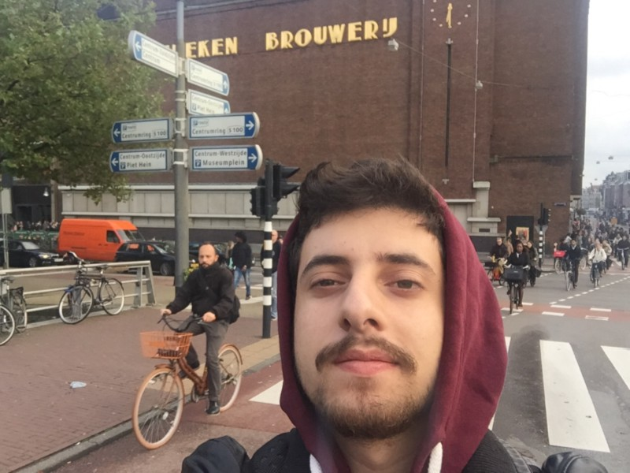

Faz uns 3/4 anos que entrei nessa tal profissão de "fazer site", e não imaginava que ia rolar tanta coisa legal na minha vida/carreira.

Mudei de cidade, morei com amigos, virei noites trabalhando, aprendi muita coisa e em questão de dias tive que aprender tudo novamente porque saiu uma "tecnologia" nova pra estudar… (e é assim até hoje).

Hoje fico super contente em saber que faço o que realmente gosto. É praticamente um hobby, e ainda sou pago pra fazer isso.

Mas enfim, quem realmente me conhece sabe que sempre tive alguns objetivos na vida, e morar fora é um deles...

Por diversas vezes cheguei naquele _"quase deu certo"_ em algumas entrevistas de emprego. Foram aprendizados muito bons pra mim... mas um dia um brother meu (a.k.a @rafaelrinaldi) me disse uma parada:

> "Cuidado com o que você deseja que uma hora vira realidade"

Pois é, esta virando realidade mesmo.

Recentemente passei por uns dos processos seletivos mais complexos da minha vida, em poucas palavras: horas e horas de entrevista, testes técnicos, conhecimentos em negócio, etc…

Achei que minhas chances fosse mínimas, mas ai veio um telefonema…

_"Olá Weslley, queremos te convidar para fazer a ultima fase do processo seletivo aqui em Amsterdam. O que acha?"_

Foi aí que realmente percebi que a coisas estavam ficando sérias mesmo.

Minha cabeça estava a mil, em duas semanas eu estaria embarcado para uma entrevista em um país diferente, com uma língua diferente da minha e o melhor de tudo: sozinho.

Minha ansiedade foi tanta que cheguei a 38.° graus de febre no dia da viagem. Até descobri que existe um posto médico muito bom no aeroporto de Guarulhos... (foi bem útil por sinal).

Mesmo com todas essas "dificuldades" criadas por mim mesmo embarquei no avião tentando focar nos meus objetivos e acreditando que os remédios iam fazer efeito e eu estaria melhor chegando la.

A coisa mais óbvia que aconteceu foi: me perdi.

Peguei o ônibus errado, tive uma pequena confusão com a máquina de bilhete… e fora que fiz um puta rolê achando que estava no lugar correto. Mas acabou dando tudo certo depois que algumas pessoas me ajudaram e finalmente encontrei o hotel que eu iria ficar.

Logo no segundo dia eu iria conhecer a empresa e enfim participar do último processo seletivo, felizmente eu já estava bem melhor... muito nervoso ainda claro (principalmente com meu o inglês), mas coloquei na minha cabeça que iria dar o melhor de mim, e deixar as coisas rolarem.

Foram quase 6 horas de conversas com desenvolvedores, gerentes, RH e etc…e o mais legal foi encontrar muitos brasileiros por lá também.

Eu não estava tão confiante nos meus resultados, na minha cabeça aquilo tudo seria um grande aprendizado para mim e mais um daqueles _"quase deu certo"_, até que no último minuto uma recruiter me chamou para uma conversa.

Ela me entregou um papel escrito bem grande **"Congratulations!"**, e tipo assim: daquilo em frente eu não consegui prestar muita atenção no que ela estava falando… tive que pedir pra ela repetir umas duas vezes até que eu realmente acreditasse no que estava acontecendo ali.

#### **Conclusão**

Hoje estou com passaporte e visto em mãos pronto para embarcar. Tenho certeza que não vai ser nada fácil, mas essa é a graça da vida né? :)

Me inspirei em escrever esse post depois que li o [esse](https://medium.com/brasil/um-brasileiro-na-bocoup-1b0f0fb9a9eb#.gr8pmdkcx) post do [Leo Balter](https://medium.com/u/6946575ea2c5) sobre uma experiência similar em que ele passou.

Vou compartilhar isso aqui também:

Minha cara de assustado/feliz conhecendo um pouco mais da cidade logo depois de sair do escritório da [Booking.com](http://www.booking.com/).
